# API de Publicaciones - Documentación

## Características de Seguridad Implementadas

### 1. **Identidad y Endpoint de Perfil**
- Endpoint estático: `GET /api/usuarios/perfil`
- Ignora parámetros del usuario
- Confía exclusivamente en el ID del Token JWT (`req.usuario.id`)

### 2. **Validación de Contraseñas (RegEx)**
- Mínimo 8 caracteres
- Al menos 1 mayúscula (A-Z)
- Al menos 1 número (0-9)
- Solo caracteres alfanuméricos
- RegEx: `/^(?=.*[A-Z])(?=.*\d)[A-Za-z\d]{8,}$/`

Ejemplo de contraseña válida: `Password123`

### 3. **Tabla de Publicaciones con Integridad**
- Campo `autor_id` es Clave Foránea hacia `usuarios(id)`
- Protección `ON DELETE RESTRICT`: previene eliminar usuarios con publicaciones
- Índices para optimización de consultas

### 4. **Delegación de Identidad al Token**
- Al crear publicación: `POST /api/publicaciones/`
- Frontend envía solo: `{titulo, contenido}`
- Backend inyecta `autor_id` del JWT automáticamente
- El usuario NO puede falsificar su identidad

### 5. **Propiedad de Datos**
- Al actualizar: `PUT /api/publicaciones/:id`
- Al eliminar: `DELETE /api/publicaciones/:id`
- Se verifica: `publicacion.autor_id === req.usuario.id`
- Retorna 403 Forbidden si no es el propietario

### 6. **Optimización SQL - Paginación**
- Parámetros: `?page=X&limit=Y`
- Cálculo de OFFSET: `(page - 1) * limit`
- Evita `SELECT *` masivos
- Implementa `LIMIT X OFFSET Y`
- Límite máximo: 100 items por página

### 7. **Optimización SQL - Búsqueda Dinámica (LIKE)**
- Parámetro: `?search=termino`
- Filtra por `titulo LIKE '%termino%'`
- Se combina con paginación

### 8. **Testing Unitario con Jest**
- Validación de RegEx de contraseñas
- Mocks de middleware de autenticación
- Casos límite cubiertos
- Ejecutar: `npm test`

---

## Endpoints Implementados

### Usuarios

#### Registro
```http
POST /api/usuarios/registro
Content-Type: application/json

{
  "nombre": "Juan Pérez",
  "email": "juan@example.com",
  "password": "Password123"
}
```

#### Login
```http
POST /api/usuarios/login
Content-Type: application/json

{
  "email": "juan@example.com",
  "password": "Password123"
}

Response:
{
  "token": "eyJhbGciOiJIUzI1NiIsInR5cCI6IkpXVCJ9..."
}
```

#### Obtener Perfil (Autenticado)
```http
GET /api/usuarios/perfil
Authorization: Bearer <token>
```

---

### Publicaciones

#### Crear Publicación (Autenticado)
```http
POST /api/publicaciones
Authorization: Bearer <token>
Content-Type: application/json

{
  "titulo": "Mi primer post",
  "contenido": "Este es el contenido de mi publicación"
}
```

#### Listar Publicaciones (Con Paginación y Búsqueda)
```http
GET /api/publicaciones?page=1&limit=10&search=curso

Response:
{
  "page": 1,
  "limit": 10,
  "datos": [
    {
      "id": 1,
      "titulo": "Curso de Node.js",
      "contenido": "...",
      "autor_id": 1
    }
  ]
}
```

#### Obtener Publicación por ID
```http
GET /api/publicaciones/:id
```

#### Actualizar Publicación (Solo propietario)
```http
PUT /api/publicaciones/:id
Authorization: Bearer <token>
Content-Type: application/json

{
  "titulo": "Título actualizado",
  "contenido": "Contenido actualizado"
}
```

#### Eliminar Publicación (Solo propietario)
```http
DELETE /api/publicaciones/:id
Authorization: Bearer <token>
```

---

## Base de Datos

### Tabla Usuarios
```sql
CREATE TABLE usuarios (
  id INT AUTO_INCREMENT PRIMARY KEY,
  nombre VARCHAR(100) NOT NULL,
  email VARCHAR(100) UNIQUE NOT NULL,
  password VARCHAR(255) NOT NULL
);
```

### Tabla Publicaciones
```sql
CREATE TABLE publicaciones (
  id INT AUTO_INCREMENT PRIMARY KEY,
  titulo VARCHAR(150) NOT NULL,
  contenido TEXT NOT NULL,
  autor_id INT NOT NULL,
  FOREIGN KEY (autor_id) REFERENCES usuarios(id)
  ON DELETE RESTRICT
);
```

Ejecutar el archivo: `sql/crear_tabla_publicaciones.sql`

---

## Pruebas (Testing)

### Ejecutar Pruebas
```bash
npm test
```

### Pruebas Disponibles

1. **Validadores de Contraseña** (`tests/validadores.test.js`)
   - 10 casos de prueba
   - Valida requisitos de seguridad
   - Casos límite incluidos

2. **Middleware de Autenticación** (`tests/autenticacion.test.js`)
   - 8 casos de prueba con mocks
   - Simula objetos req, res, next
   - Prueba token válido/inválido/expirado

---

## Estructura del Proyecto

```
proyecto-api3/
├── src/
│   ├── config/
│   │   └── db.js
│   ├── controllers/
│   │   ├── usuarioController.js
│   │   └── publicacionController.js
│   ├── models/
│   │   ├── usuarioModel.js
│   │   └── publicacionModel.js
│   ├── routes/
│   │   ├── usuarioRoutes.js
│   │   └── publicacionRoutes.js
│   ├── middlewares/
│   │   └── autenticacion.js
│   └── utils/
│       └── validadores.js
├── tests/
│   ├── validadores.test.js
│   └── autenticacion.test.js
├── sql/
│   └── crear_tabla_publicaciones.sql
├── index.js
├── package.json
└── .env
```

---

## Instalación y Ejecución

### Instalar dependencias
```bash
npm install
```

### Variables de entorno (.env)
```
DB_HOST=localhost
DB_USER=root
DB_PASSWORD=
DB_NAME=mi_base_datos
JWT_SECRET=mi_clave_secreta_muy_segura
PORT=3000
```

### Iniciar servidor (Modo desarrollo)
```bash
npm run dev
```

### Ejecutar pruebas
```bash
npm test
```

---

## Checklist de Requisitos

- [x] Endpoint de perfil estático con JWT
- [x] RegEx para validación de contraseñas (8+ chars, mayúscula, número)
- [x] Tabla de publicaciones con Foreign Key
- [x] Protección ON DELETE RESTRICT
- [x] Delegación de identidad al token
- [x] Verificación de propiedad antes de UPDATE/DELETE
- [x] Paginación con LIMIT & OFFSET
- [x] Búsqueda dinámica con LIKE
- [x] Testing unitario con Jest (validadores)
- [x] Mocks de middlewares en Express
- [x] Documentación completa
- [x] Repositorio público en GitHub

---

## Notas de Seguridad

1. **Nunca confiar en Frontend**: Toda validación se repite en Backend
2. **JWT en Authorization**: Siempre usar `Authorization: Bearer <token>`
3. **Contraseña Hashada**: Usamos bcrypt con 10 salt rounds
4. **Token Expirado**: Expira cada 2 horas
5. **Propiedad de Datos**: Se verifica ID antes de cualquier UPDATE/DELETE
6. **Integridad Referencial**: No se pueden eliminar usuarios con publicaciones

---

## Evidencias

### Pruebas unitarias y cobertura

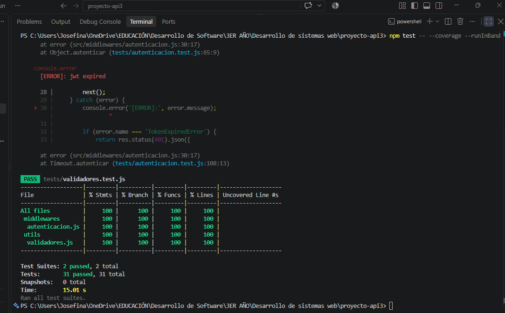

### Pruebas con Postman

#### Registro y autenticación

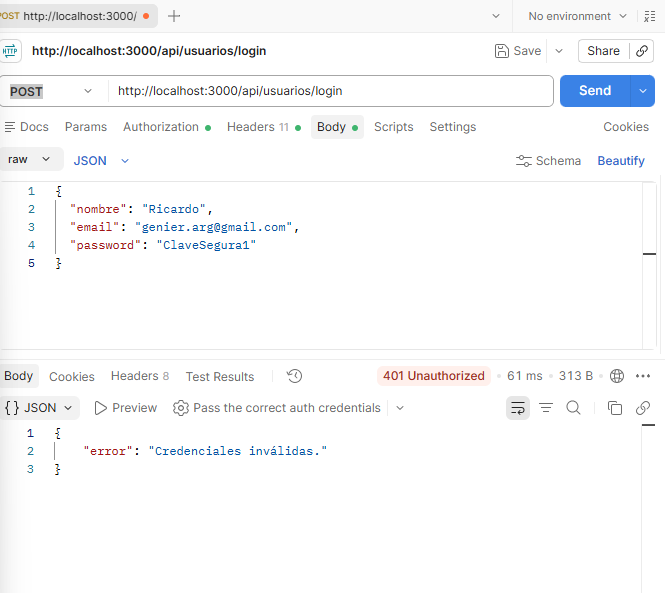

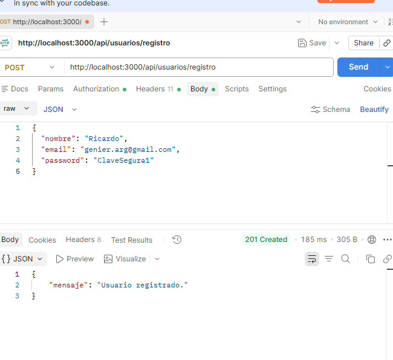

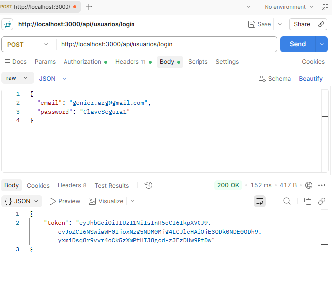

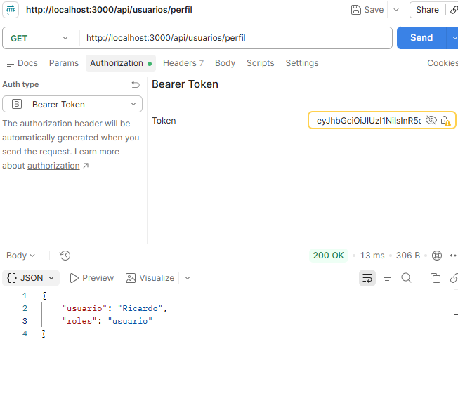

#### Publicaciones, paginación y búsqueda

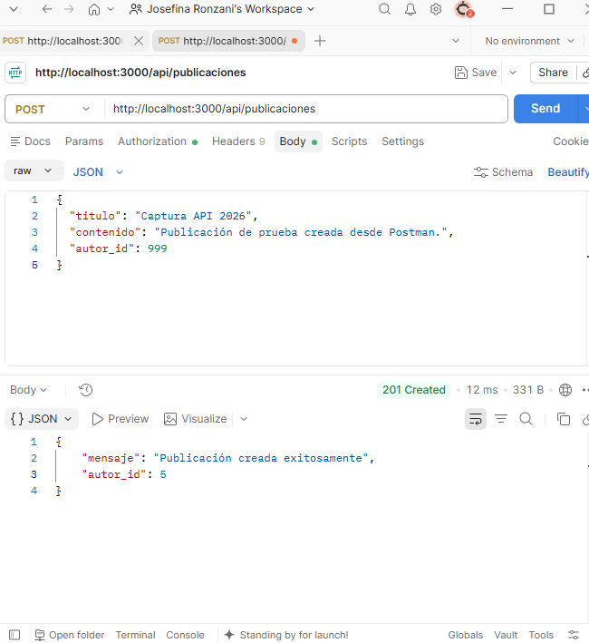

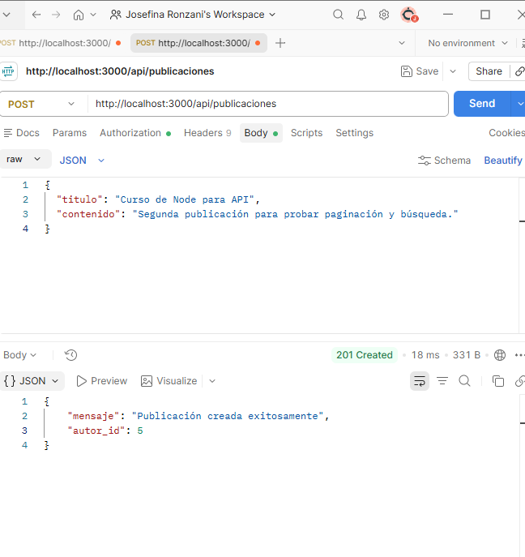

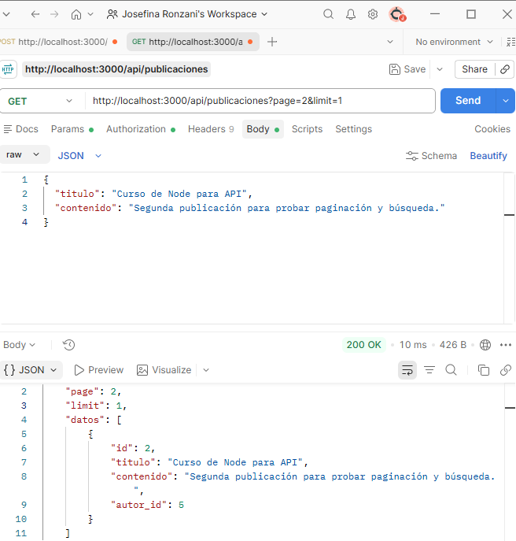

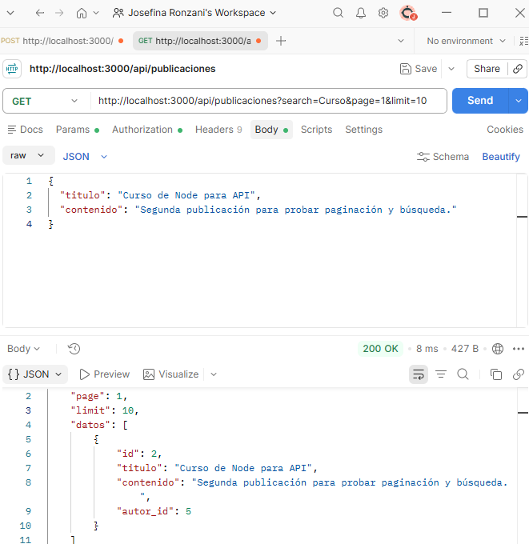

#### Bloqueos de seguridad

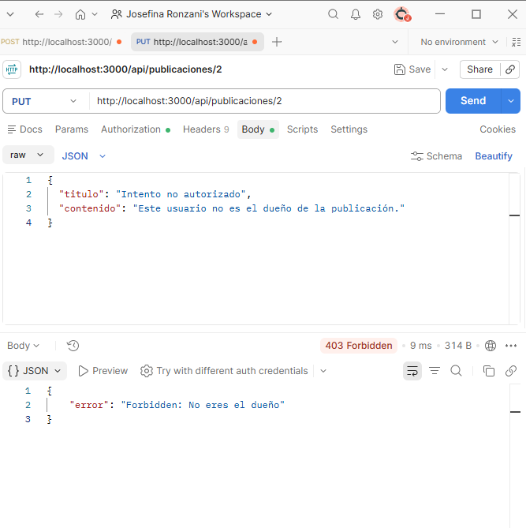

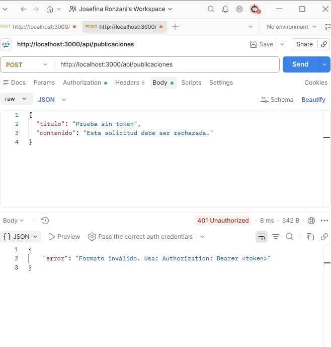

### Integridad de la base de datos

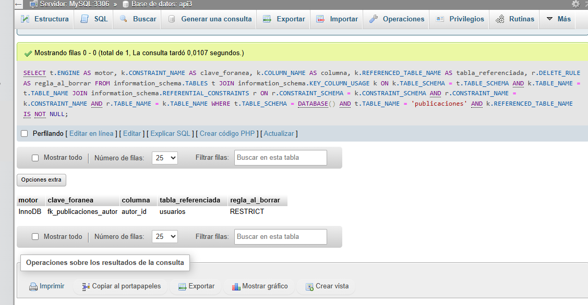

---

**Última actualización**: 2026-09-14
